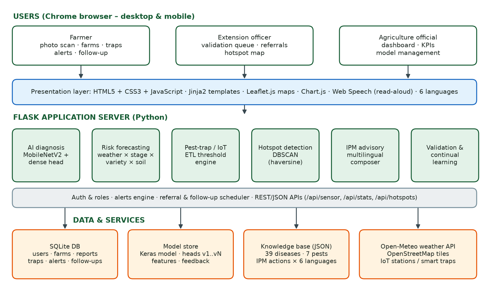
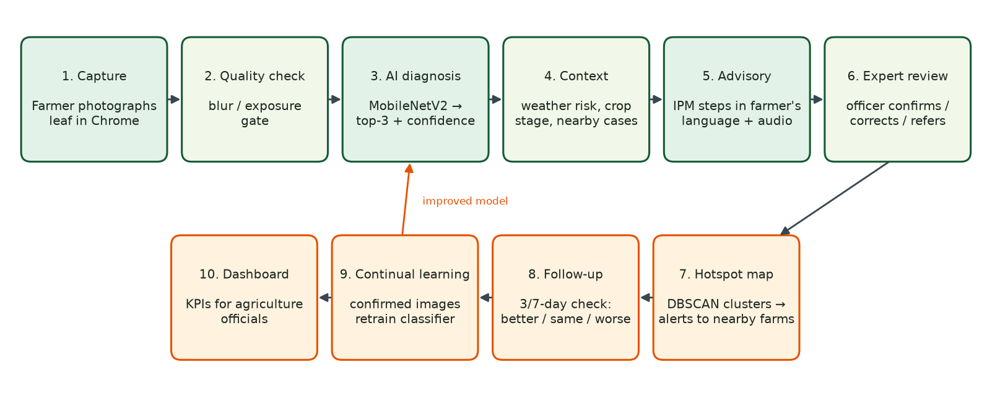

# 🌿 KrishiRakshak

### AI-Based Early Detection and Management of Crop Diseases and Pest Infestations

KrishiRakshak is a crop-health website that runs in **Google Chrome** on a computer or a mobile phone. A farmer takes a photo of a sick leaf, and the system:

- identifies the disease,
- tells the farmer how risky the next 7 days are for their farm,
- gives step-by-step advice in their own language, and
- sends the case to an agriculture expert for confirmation.

Agriculture officials see outbreaks on a live map and dashboard.

---

## 📑 Contents
1. [Problem Statement](#1-problem-statement)
2. [Our Solution](#2-our-solution)
3. [Key Features](#3-key-features)
4. [System Architecture](#4-system-architecture)
5. [How It Works (Workflow)](#5-how-it-works-workflow)
6. [Tech Stack](#6-tech-stack)
7. [AI Model & Results](#7-ai-model--results)
8. [How to Run the Project](#8-how-to-run-the-project)
9. [Using the Website](#9-using-the-website)
10. [Project Structure](#10-project-structure)
11. [Limitations & Future Work](#11-limitations--future-work)

---

## 1. Problem Statement

**Title:** *Early detection and management of crop diseases and pest infestations*

Farmers often recognise crop diseases or pest attacks only **after visible damage has already spread**. The problem has several parts:

| Problem | Effect |
|---|---|
| Extension officers cover very large areas | Expert advice reaches farmers late |
| Laboratory diagnosis is slow and far away | Treatment is delayed |
| Weather, crop stage, variety, soil and local pest history all affect risk, but are **never combined** | No farm-level early warning |
| Wrong diagnosis | Wrong or excess pesticide, higher cost, residues, yield loss |

**Expected solution:** a farmer- and extension-worker-friendly system with:
- image-based symptom identification
- pest-trap and sensor inputs
- weather-based risk forecasting
- geospatial hotspot mapping
- expert validation
- multilingual advisories
- IPM (Integrated Pest Management) recommendations with safe input use
- referral to labs
- follow-up monitoring
- learning from field confirmations
- dashboards for agriculture officials

**Expected outcomes:** earlier detection, less crop loss, more targeted pesticide use, faster extension response, better surveillance coverage and better planning of preventive measures.

---

## 2. Our Solution

KrishiRakshak combines **three kinds of intelligence** in one website:

| | What it answers | How |
|---|---|---|
| 🧠 **Computer vision** | *"What is wrong with my crop?"* | A deep-learning model (MobileNetV2) looks at the leaf photo |
| 🌦 **Risk forecasting** | *"Will it spread on my farm in the next days?"* | Live weather + crop stage + variety + soil + nearby cases |
| 👩‍🔬 **Human expertise** | *"Is the AI right? What should I do?"* | Extension officers confirm or correct every diagnosis |

---

## 3. Key Features

| # | Feature | Description |
|---|---|---|
| 1 | 📷 **Photo diagnosis** | Upload or capture a leaf photo and get the disease name with a confidence score and the top-3 predictions. Blurry or dark photos are flagged. |
| 2 | 🌦 **Weather risk forecast** | 7-day risk (Low / Moderate / High / Severe) for every farm from live weather, using 12 scientific disease models (e.g. the Hutton criteria for late blight). |
| 3 | 🪤 **Pest traps & IoT sensors** | Farmers log trap counts, or devices send readings automatically. An alert fires when the **Economic Threshold Level (ETL)** is crossed. |
| 4 | 📍 **Hotspot map** | Confirmed cases are grouped with **DBSCAN** clustering. The map shows outbreak zones and a heatmap, and nearby farms get an alert. |
| 5 | 👩‍🔬 **Expert validation** | Officers work through a prioritised queue and confirm, correct or reject each diagnosis, set severity and refer to a lab. |
| 6 | 🗣 **Multilingual advice** | IPM advice in **English, हिन्दी, తెలుగు, தமிழ், ಕನ್ನಡ, मराठी**, with a 🔊 read-aloud button. |
| 7 | 🧪 **Safe pesticide use** | Field practices → biological control → chemicals **only as a last resort**, with dose, pre-harvest interval and safety steps. |
| 8 | 🏥 **Lab referral** | Low-confidence, viral or notifiable diseases are referred to the nearest plant-health lab. |
| 9 | 📅 **Follow-up** | A re-check is scheduled after 3 or 7 days. The farmer reports *better / same / worse*, and cases that get worse are escalated. |
| 10 | 🔁 **Continual learning** | Images confirmed by experts retrain the model. A new version goes live only if accuracy does not drop. |
| 11 | 📊 **Officials' dashboard** | Reports per week, top diseases, district-wise cases, AI–expert agreement, response time, coverage and trap exceedances. |

---

## 4. System Architecture



```
┌───────────────────────────── USERS (Google Chrome – desktop & mobile) ─────────────────────────────┐
│      👨‍🌾 Farmer                   👩‍🔬 Extension Officer                 🏛 Agriculture Official          │
│  scan · farms · traps · alerts     validation · referral · map         dashboard · KPIs · model      │
└──────────────────────────────────────────────┬──────────────────────────────────────────────────────┘
                                               │
┌──────────────────────── FRONT-END (HTML5 · CSS3 · JavaScript · Jinja2) ─────────────────────────────┐
│        Leaflet.js maps  ·  Chart.js dashboards  ·  Web Speech API (read aloud)  ·  6 languages        │
└──────────────────────────────────────────────┬──────────────────────────────────────────────────────┘
                                               │ HTTP / JSON
┌──────────────────────────────── BACK-END (Python · Flask) ──────────────────────────────────────────┐
│  ┌────────────┐ ┌─────────────┐ ┌───────────┐ ┌────────────┐ ┌─────────────┐ ┌──────────────────┐   │
│  │ AI         │ │ Risk        │ │ Trap/IoT  │ │ Hotspot    │ │ IPM advisory│ │ Validation &     │   │
│  │ diagnosis  │ │ forecasting │ │ ETL engine│ │ DBSCAN     │ │ (6 langs)   │ │ continual        │   │
│  │ MobileNetV2│ │ 12 models   │ │           │ │            │ │             │ │ learning         │   │
│  └────────────┘ └─────────────┘ └───────────┘ └────────────┘ └─────────────┘ └──────────────────┘   │
│        Login & roles · Alert engine · Follow-up scheduler (every 6 h) · REST APIs                    │
└──────────────────────────────────────────────┬──────────────────────────────────────────────────────┘
                                               │
┌──────────────────────────────────── DATA & SERVICES ────────────────────────────────────────────────┐
│  🗄 SQLite database   │  🧠 Model store         │  📚 Knowledge base (JSON) │  🌐 External               │
│  users, farms,        │  Keras model,           │  39 diseases, 7 pests,    │  Open-Meteo weather API,   │
│  reports, traps,      │  versions v1…vN,        │  17 crops, IPM actions    │  OpenStreetMap tiles,      │
│  alerts, follow-ups   │  training features      │  in 6 languages           │  IoT devices               │
└───────────────────────┴─────────────────────────┴───────────────────────────┴───────────────────────────┘
```

### Main modules

| Module | File | What it does |
|---|---|---|
| Web server & pages | `app.py` | Routes, login/roles, alerts, follow-ups, REST APIs |
| AI diagnosis | `ml_service.py` | Loads the model, checks photo quality, predicts, retrains |
| Model training | `ml/train.py` | Trains MobileNetV2 on the PlantVillage dataset |
| Risk forecasting | `risk.py` | Fetches weather and calculates the 7-day disease/pest risk |
| Hotspot detection | `hotspots.py` | DBSCAN clustering of confirmed cases |
| Knowledge base | `kb/` | Diseases, pests, crops, IPM advice in 6 languages |
| Translations | `i18n/` | All website text in English, Hindi, Telugu, Tamil, Kannada, Marathi |
| Database | `db.py` | SQLite tables |

### How the risk score is calculated

```
Risk = 85 × Weather favourability × Crop-stage factor × Variety resistance × Drainage/Irrigation factor
       + 6 × (confirmed cases within 10 km in the last 21 days, max +25)

  0–24 Low   ·   25–49 Moderate   ·   50–74 High   ·   75–100 Severe
```

---

## 5. How It Works (Workflow)



1. **Register farm:** location (GPS or map), crop, variety, sowing date, soil, drainage, irrigation.
2. **Daily alerts:** the system checks weather risk for every farm every 6 hours.
3. **Scan a leaf:** the farmer uploads a photo in Chrome.
4. **Quality check:** blurry or dark photos are flagged.
5. **AI diagnosis:** top-3 diseases with confidence.
6. **Context:** the weather risk for that disease on this farm ("Act now!").
7. **Advice:** IPM steps in the farmer's language, with read-aloud.
8. **Expert review:** an officer confirms or corrects the diagnosis and refers to a lab if needed.
9. **Hotspot update:** the map is updated and nearby farmers are warned.
10. **Follow-up:** after 3 or 7 days the farmer reports *better / same / worse*.
11. **Learning:** confirmed images improve the AI model.
12. **Dashboard:** officials monitor everything.

---

## 6. Tech Stack

| Layer | Technology | Why we used it |
|---|---|---|
| **Front-end** | HTML5, CSS3, JavaScript, Jinja2 templates | Simple, fast, works in Chrome on mobile and desktop |
| **Maps** | Leaflet.js + OpenStreetMap + Leaflet.heat | Free, open-source maps and heatmap (no API key) |
| **Charts** | Chart.js | Dashboard and weather charts |
| **Voice** | Web Speech API (built into Chrome) | Reads advice aloud for farmers |
| **Back-end** | Python 3.12, Flask 3 | Lightweight web server; works directly with the AI model |
| **Deep learning** | TensorFlow 2.18 / Keras, MobileNetV2 | Accurate and light enough for a normal laptop CPU |
| **ML tools** | scikit-learn, NumPy, Pillow, Matplotlib | DBSCAN clustering, metrics, image processing, graphs |
| **Database** | SQLite | No installation or setup needed |
| **Weather** | Open-Meteo API | Free live weather forecast, no API key |
| **Dataset** | PlantVillage (54,305 leaf images + 1,143 background images) | Standard benchmark for plant-disease AI |
| **Documents** | python-pptx, python-docx | Generates the PPT and the report automatically |

---

## 7. AI Model & Results

**Model:** MobileNetV2 pre-trained on ImageNet (used as a frozen feature extractor), followed by Dropout → Dense(256) → Softmax(39 classes).
**Data:** 55,448 images in 39 classes (38 crop/disease classes of 14 crops + background). Split 70% train / 15% validation / 15% test.

| Metric | Result |
|---|---|
| ✅ **Test accuracy** | **97.01 %** |
| ✅ **Top-3 accuracy** | **99.82 %** |
| Macro F1-score | 0.963 |
| Test images (never seen in training) | 8,318 |
| Training time (laptop CPU, no GPU) | ~45 min (feature extraction) + ~5 min (classifier) |
| After retraining on expert-confirmed images (v2) | 96.78 % (accepted: within the 0.5-point safety limit) |

Training graphs, the confusion matrix and per-class scores are in `ml/plots/` and on the **AI model** page of the website.

---

## 8. How to Run the Project

### Requirements
- Windows / Linux / macOS
- **Python 3.10 – 3.12** (tested on 3.12)
- **Google Chrome**
- Internet connection (for live weather and map tiles)

### Step 1: Install the libraries
Open a terminal inside the `KrishiRakshak` folder and run:
```bash
pip install -r requirements.txt
```

### Step 2: Start the website
```bash
python app.py
```
On Windows you can simply **double-click `run.bat`**.

### Step 3: Open in Chrome
Go to 👉 **http://localhost:5000**

To open it on a phone on the same Wi-Fi, use `http://<your-computer-IP>:5000`.

### Step 4: Log in with a demo account

| Role | Username | Password | What you can do |
|---|---|---|---|
| 👨‍🌾 Farmer | `farmer` | `farmer123` | Scan leaves, see farm risk, log traps, follow-ups |
| 👩‍🔬 Extension officer | `officer` | `officer123` | Validate diagnoses, map, dashboard, retrain model |
| 🏛 Official / admin | `admin` | `admin123` | Everything the officer can do |

Change the language from the dropdown at the top right: **English / हिन्दी / తెలుగు / தமிழ் / ಕನ್ನಡ / मराठी**.

> The trained model and the demo database are **already included**, so you do not need to train anything to run the website.

### Optional: Rebuild from scratch
> Not stored on GitHub because of size: the PlantVillage dataset (~870 MB) and `ml/features.npz` (189 MB training cache).
> The website runs without them. You only need them to **retrain** the model or **re-seed** the demo data.

Download the dataset from [Mendeley Data – Plant leaf diseases dataset (without augmentation)](https://data.mendeley.com/datasets/tywbtsjrjv/1), then:
```bash
# 1. Unzip it and rename the folder to ml/data/plantvillage/  (39 class sub-folders)
python ml/train.py        # trains the model (~50 min on CPU)
python seed.py            # recreates the demo database
```

### Optional: Simulate an IoT trap / weather station
```bash
python iot_simulator.py --farm 1 --pest helicoverpa --count 7
```
Devices send JSON to `POST /api/sensor` with the header `X-Device-Key: demo-device-key`.

### Optional: Regenerate the PPT and report
```bash
python docs/screenshots.py farmer=farmer:farmer123 officer=officer:officer123   # website must be running
python docs/export_stats.py
python docs/build_ppt.py
python docs/build_report.py
```

---

## 9. Using the Website

**As a farmer**
1. Log in and see your farms, today's weather and the 7-day risk.
2. Click **📷 Scan crop**, choose a leaf photo and click **Diagnose**.
3. Read or 🔊 listen to the advice, then check the lab referral (if any).
4. Log pest-trap counts on the farm page.
5. Answer the follow-up after 3 or 7 days.

**As an extension officer**
1. Open the **Validation queue** (most urgent cases first).
2. Confirm or correct the diagnosis, set severity and refer to a lab if needed.
3. View the **Hotspot map** and the **Dashboard**.
4. On the **AI model** page, click **Retrain** to learn from confirmed cases.

---

## 10. Project Structure

```
KrishiRakshak/
├── app.py               # Flask web server: pages, login, alerts, REST APIs
├── ml_service.py        # AI inference, photo quality check, retraining
├── risk.py              # Weather fetching + 12 disease risk models
├── hotspots.py          # DBSCAN outbreak detection
├── db.py                # SQLite database tables
├── seed.py              # Creates demo farms, reports and traps
├── iot_simulator.py     # Simulates an IoT weather station / smart trap
├── run.bat              # One-click start on Windows
├── requirements.txt
├── kb/                  # Knowledge base: diseases, pests, crops, IPM actions (6 languages)
├── i18n/                # Website translations (build_i18n.py is the source)
├── templates/           # 19 HTML pages
├── static/              # CSS, JS libraries (Leaflet, Chart.js), uploaded photos
├── ml/
│   ├── train.py         # Model training script
│   ├── model/           # Trained model, labels, metrics, versions
│   ├── plots/           # Training curves, confusion matrix, class distribution
│   └── data/            # PlantVillage dataset
└── docs/
    ├── KrishiRakshak_Presentation.pptx / .pdf    # Project PPT (19 slides)
    ├── KrishiRakshak_Project_Report.docx / .pdf  # Project report
    ├── screenshots/     # Website screenshots
    └── assets/          # Architecture & workflow diagrams
```

### REST API

| Endpoint | Method | Purpose |
|---|---|---|
| `/api/sensor` | POST | IoT weather station / smart trap data |
| `/api/farm/<id>/risk` | GET | 7-day risk forecast for a farm |
| `/api/hotspots` | GET | Current outbreak hotspots |
| `/api/reports` | GET | Map data of reports (officers) |
| `/api/stats` | GET | Dashboard numbers (officers) |

---

## 11. Limitations & Future Work

**Limitations**
- The AI was trained on PlantVillage lab photos (plain background). Accuracy on real field photos will be lower until field photos are collected, which is why expert validation is built in.
- The image model covers 14 crops. Rice, cotton and brinjal have risk and pest modules but no photo model yet.
- Demo farms, farmers and outbreaks are **synthetic**. The leaf images and AI predictions are real.
- Pesticide doses are indicative; always follow the product label and local agriculture officer.

**Future work**
- Collect field photos for rice, cotton, chilli and pulses, and fine-tune the full model.
- Offline Android app with an on-device TensorFlow Lite model.
- SMS / WhatsApp / voice-call alerts for farmers without smartphones.
- Real smart traps with automatic insect counting, and satellite (NDVI) crop-stress maps.

---

<p align="center">Made for the course project · Joy University · Subject code 24BTDS145</p>
